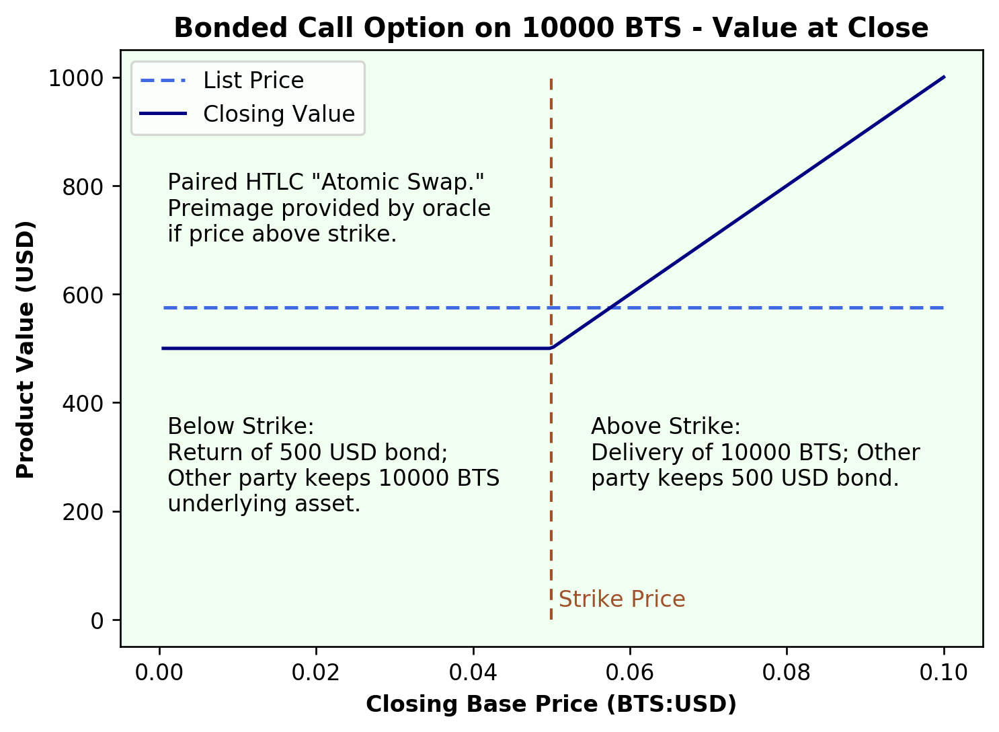
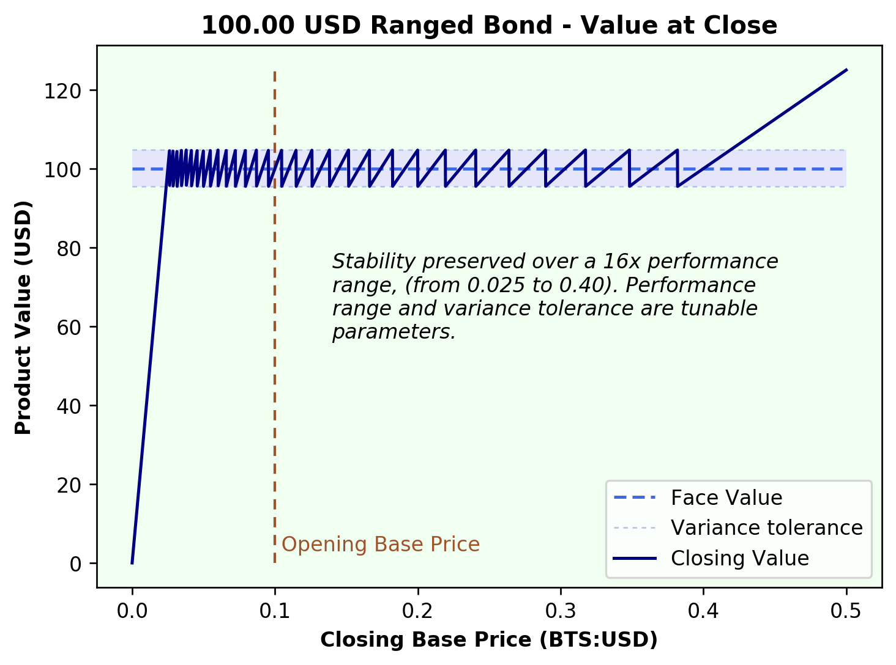
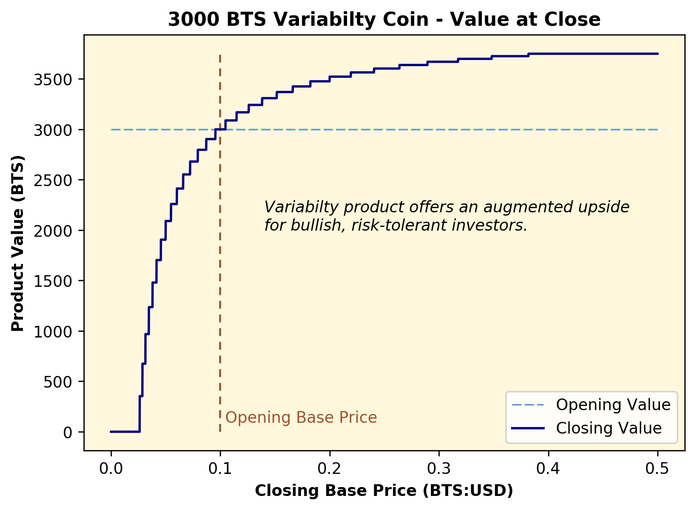

# HTLCProductsSim
A library for simulating financial products based on hash oracles

## Hash Oracles
A hash oracle is an entity that publishes real-world data (such as price observations) by conditionally revealing the preimage to a previously published hash.  In order for contracts to be built upon these hashes, the hashes need to be published in advance, and their preimages either revealed or not revealed on the target date based on the oracle's assessment of the external condition.

Example:  Oracle publishes hash `H` one month prior to date `D`.  On date `D`, oracle reveals preimage `P : Hash(P)=H` if the price of Bitcoin exceeds $10,000.00, but does _not_ reveal the preimage otherwise.

In practice, a hash oracle would likely publish, in advance, daily (or even hourly) tables of hashes representing sequences of price levels, allowing for a fine-grained representation of price data.

### Are hash oracles trusted or trustless?

They are trusted parties.  An insider with access to the preimages could wreak havoc if they acted inapropriately.  A trusted oracle would need to invest in protecting their reliability and reputation.  There are potential strategies to achieve this.

Products using the hashes could mitigate risk by conditioning their contracts on hashes from mulitple, competing oracles.

## HTLC Products as Options

(background and explanation...)

## Examples

### Atomic Swaps as Call Options

Two HTLCs, each predicated on the same hash, for which preimage will be revealed only if share price on underlying exceeds strike price:

* HTLC 1: From Buyer to Writer for 500 USD
* HTLC 2: From Writer to Buyer for 1000 BTS
* Srike price at 0.05 BTS:USD

### Bounded Stable Coin and corresponding Variability

A collection of several HTLCs from party A to party B, each triggered at a different price level, and for an amount crafted to bring the "stable" product back into it's target valuation window.

